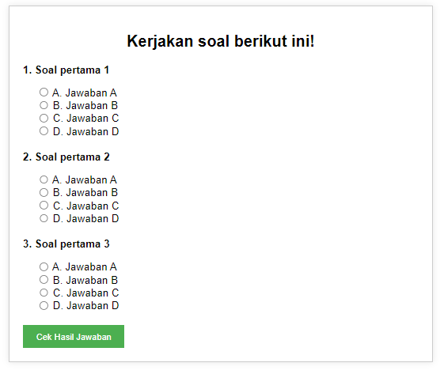

# APLIKASI SEDERHANA QUIZ

Aplikasi ini adalah kuis sederhana yang dirancang untuk menguji pengetahuan pengguna melalui serangkaian pertanyaan pilihan ganda. Pengguna akan diminta untuk memilih jawaban dari setiap pertanyaan dan setelah semua pertanyaan dijawab, mereka dapat memeriksa hasilnya.

## Fitur

- **Pertanyaan**: Terdapat beberapa soal pilihan ganda.
- **Validasi Jawaban**: Pengguna diharuskan memilih jawaban sebelum mengirimkan form.
- **Skor**: Hasil akhir berupa nilai yang dihitung berdasarkan jumlah jawaban yang benar.

## Cara Memakai

1. **Pilih Jawaban**:
   - Untuk setiap soal, pilih salah satu jawaban yang tersedia (A, B, C, atau D) dengan cara mengklik pada tombol yang sesuai.

2. **Kirim Jawaban**:
   - Setelah menjawab semua pertanyaan, klik tombol **"Cek Hasil Jawaban"** untuk mengirimkan jawaban Anda.

3. **Lihat Hasil**:
   - Setelah mengirimkan jawaban, aplikasi akan menghitung dan menampilkan skor Anda berdasarkan jawaban yang benar. Skor akan ditampilkan di bawah form kuis.
  
---
  

